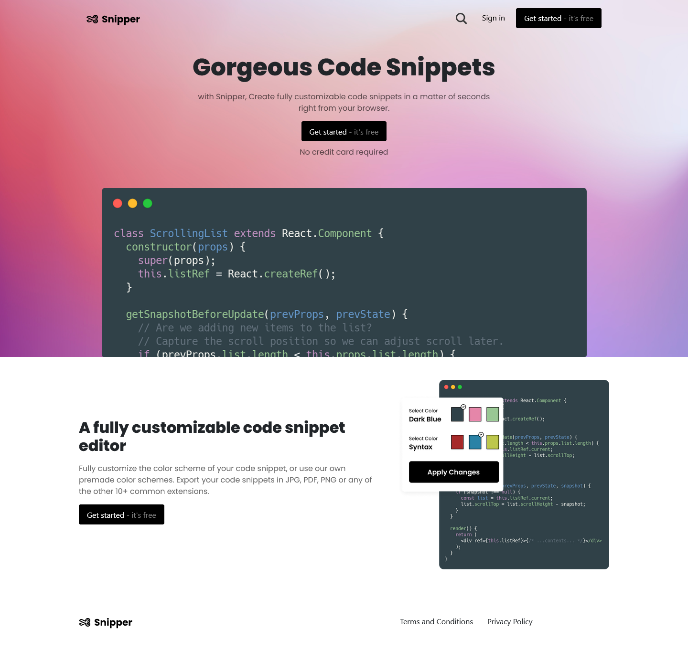
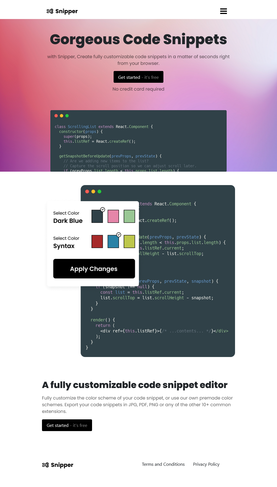
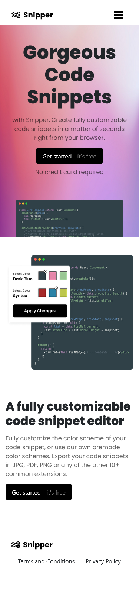

# CodeWell - Snipper Landing Page

This is a solution to the [Snipper Landing Page](https://www.codewell.cc/challenges/snipper-landing-page--608bbe67e0984a001540d79b). Codewell challenges help you improve your coding skills by building realistic projects.

## Table of contents

- [Overview](#overview)
  - [The challenge](#the-challenge)
  - [Screenshot](#screenshot)
  - [Links](#links)
- [My process](#my-process)
  - [Built with](#built-with)
- [Author](#author)

## Overview

### The challenge

Users should be able to:

- View the optimal layout for the interface depending on their device's screen size
- See hover states for all interactive elements on the page

### Screenshot

- Desktop view:

- Tablet view:

- Mobile view:

### Links

- Live Site URL: [Snipper Landing Page](https://ibrahim-mohamedh.github.io/Snipper-Landing-Page/)

## My process

### Built with

- Semantic HTML5 markup
- CSS custom properties
- Bootstrap
- Jquery
  - [WoW Animation](https://wowjs.uk/)
  - [niceScroll](https://github.com/inuyaksa/jquery.nicescroll)
- FontAwesome

## Author

- Website - [Ibrahim-MohamedH](https://github.com/Ibrahim-MohamedH)
- LinkedIn - [Ibrahim Mohamed](https://www.linkedin.com/in/ibrahim-mohamed-hussein/)
- Frontend Mentor - [@Ibrahim-MohamedH](https://www.frontendmentor.io/profile/Ibrahim-MohamedH)
